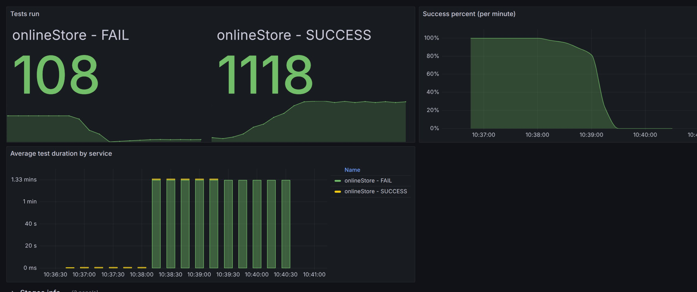
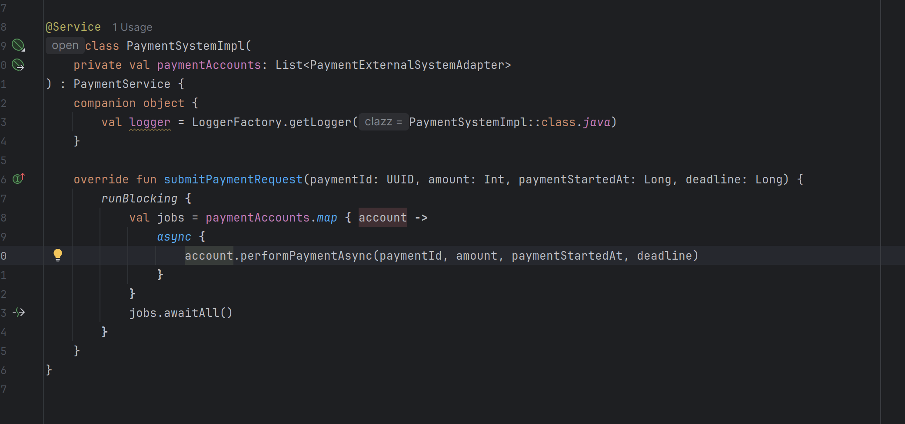
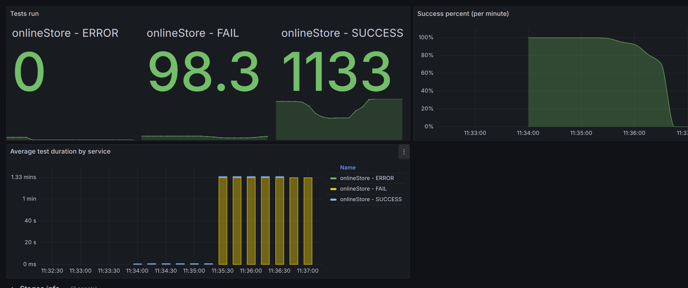

**Анализ изначальных условий:**

{

\"ratePerSecond\": 11,

\"testCount\": 1200

}

Обычный кейс, описывающий стандартное использование сайта, без аномалий.

{width="6.6930555555555555in"
height="2.807638888888889in"}

По картинке видно, что приложение неплохо справляется с нагрузкой даже
без переработок.

**Идеи:**

**-** ассинхронная обработка запросов

\- проставление задержки, чтобы у программы было больше времени
обработать каждый запрос

Реализация идей:

**Реализация идей:**

\- проставление задержки, чтобы у программы было больше времени
обработать каждый запрос

Данная идея не дала результата, почти такие же показатели как на
изначальной картинке.

**-** ассинхронная обработка запросов

{width="6.6930555555555555in" height="3.14375in"}

Использовано:

\- Assync (парралельный запуск платежей), что по идее может повысить
скорость их обработки

\- Использование runBlocking с awaitAll (метод будет ждать завершения
всех ассинхронных задач перед выходом, что добавляет к надежности)

{width="6.6930555555555555in"
height="2.807638888888889in"}

Как видно результаты стали чуть лучше, но сильного прироста все равно
нет.
