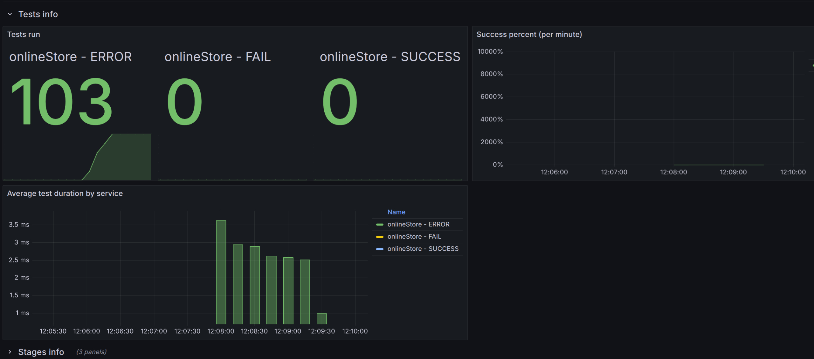
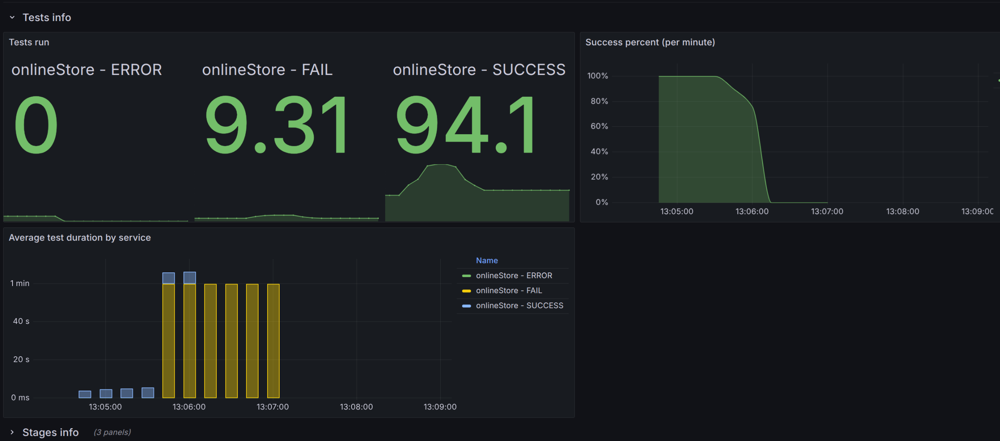

**Анализ изначальных условий:**

{

\"ratePerSecond\": 2,

\"testCount\": 100,

\"processingTimeMillis\": 60000 }

.

В данной работе был добавлен параметр максимального времени обработки.

{width="6.6930555555555555in"
height="2.9541666666666666in"}

По картинке видно, что приложение вообще не справляется. Можно
предположить, что данный функционал в нем не реализован.

**Идеи:**

\- внедрение временного лимита

**Реализация идей:**

\- внедрение временного лимита

{width="6.6930555555555555in"
height="2.9541666666666666in"}

Видим, что все равно есть зафейленные задачи, но их значительно меньше,
чем в оригинальном тесте.
