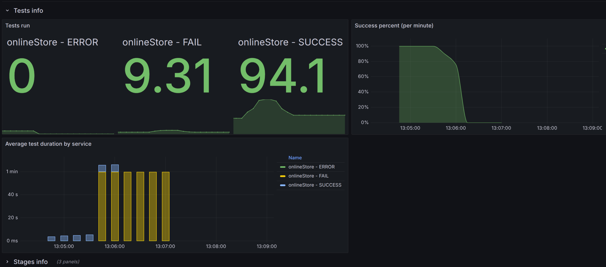

**Анализ изначальных условий:**
{ 
"ratePerSecond": 2, 
"testCount": 500, 
"processingTimeMillis": 60000 }

. 
Данная работа очень похожа на 2-ую, только количество тестов увеличилось в 5 раз.

{width="6.6930555555555555in" height="3.14375in"}

По картинке видно, что приложение работает отлично, это происходит по данным причинам:
- в первой лабораторной была добавлена ассинхронная обработка, что помогает при увеличении числа запросов
- во-второй был добавлен rate_limit, который позволяет контролировать скорость.

Оба данных инструмента весьма хорошо справляются с выполнением данной лабораторной и мне даже сложно предположить, что можно добавить для улучшения.

