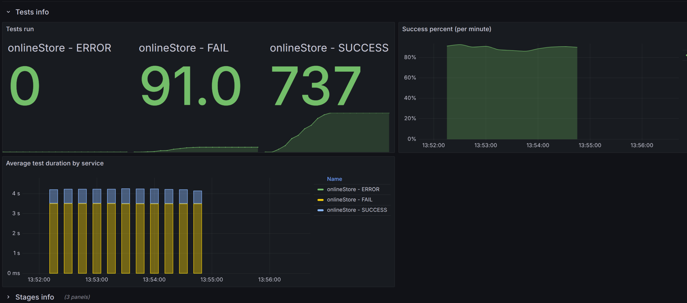
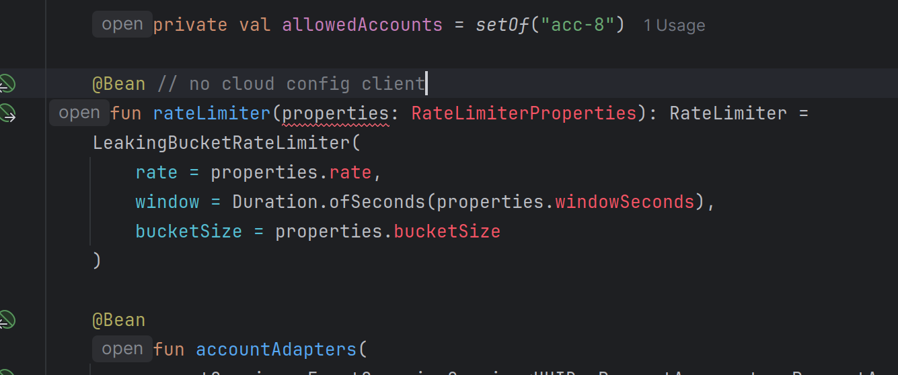
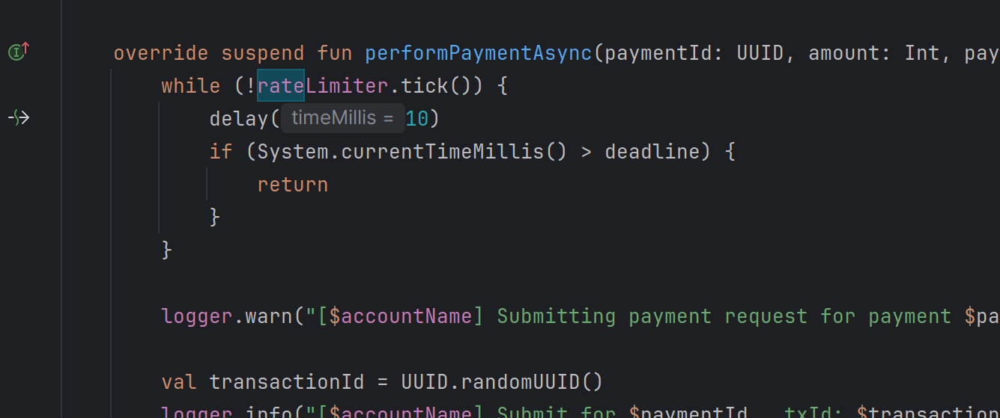
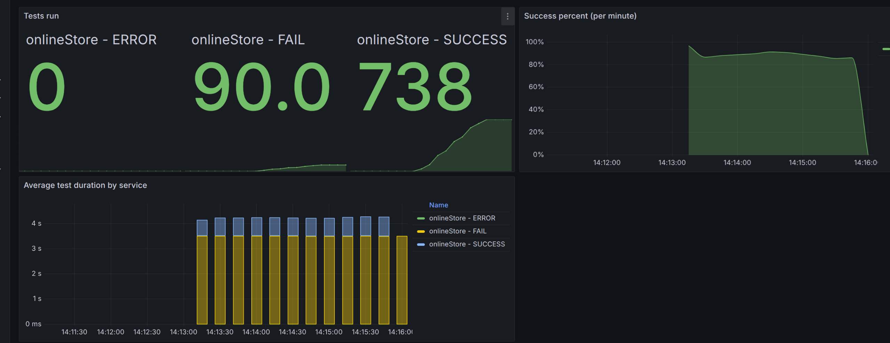

**Анализ изначальных условий:**

{
  "ratePerSecond": 7,
  "testCount": 800,
  "processingTimeMillis": 3500
}

{width="6.6930555555555555in" height="3.14375in"}
.
Данная работа похожа на прошлую. Но показатели графиков отлчичаются не в лучшую сторону.

**Идеи:**
в лекциях упоминалось использование windows control c rate limiting, поэтому я решил усовершенствовать эти методы. В голову пришло две идеи:
- сделать автоматическое установление параметров в rate limit
- перевести ожидание в ассинхронный режим

**Реализация идей:**

- сделать автоматическое установление параметров в rate limit

Когда думал как реализовать идею, наткнулся на Spring cloud config client с методом RefreshScope, но так и не смог его нормально установить, во многом потому, что это отдельное расширение и сразу поднимается вопрос – нужно ли его добавлять в проект, насколько это будет оправданно. Привел пример реализации.

{width="6.6930555555555555in" height="3.14375in"}

- перевести ожидание в ассинхронный режим

Заметил, что у меня используется Thread.Sleep, которая как будто плохо работает с ассинхронным вариантом. Решил заменить его на delay, но большого прироста это не принесло.

{width="6.6930555555555555in" height="3.14375in"}

{width="6.6930555555555555in" height="3.14375in"}

