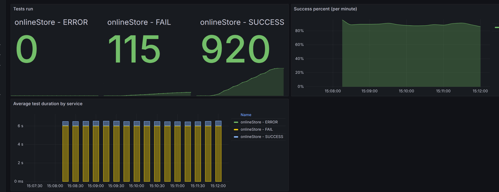

**Анализ изначальных условий:**

{
  "ratePerSecond": 7,
  "testCount": 800,
  "processingTimeMillis": 3500
}

{width="6.6930555555555555in" height="3.14375in"}
.
Видим достаточно хорошие результаты уже изначально.

**Идеи:**
- поиграться с настройками ratelimiter
- в лекциях упоминается использование: delay, client timeout, deadline propagation

**Реализация идей:**

- поиграться с настройками ratelimiter

ничего не дало, попадания ухудшаются.

- в лекциях упоминается использование: delay, client timeout, deadline propagation

delay был встроен в предыдущей лабе

client timeout – есть ожидание разрешения в rateLimiter.tick()

есть проверка дедлайна.

Ручное изменение параметров ratelimiter не дало каких-то значимых результатов, а идей новых не пришло. В целом изначальный результат уже неплохой.

