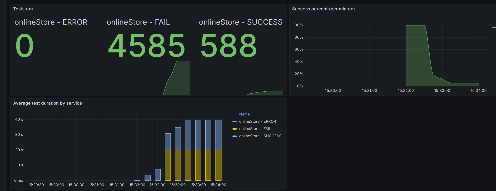
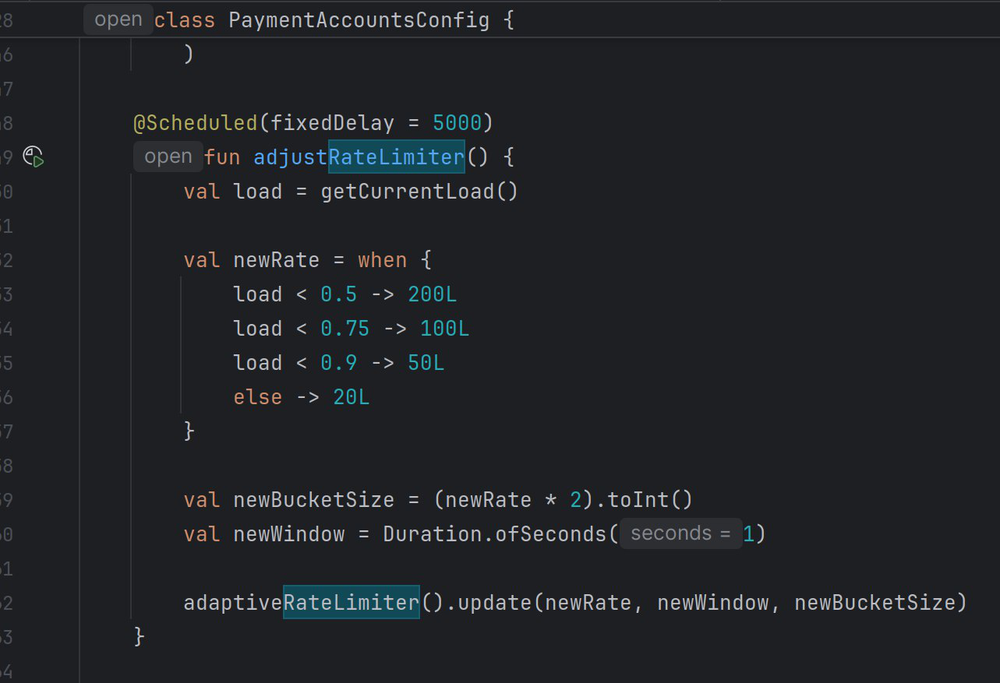
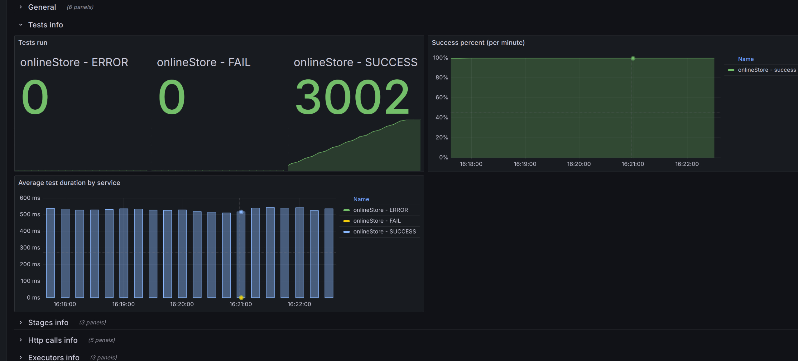

**Анализ изначальных условий:**

{ 
"ratePerSecond": 100, 
"testCount": 5000, 
"processingTimeMillis": 20000 
}

{width="6.6930555555555555in" height="3.14375in"}
.
Ужасное поведение программы, падает на сильной нагруженности.

**Идеи:**
- Сказывается константность переменных: rate, window, bucketSize, идея в том, чтобы изменять их динамически

**Реализация идей:**

- Сказывается константность переменных: rate, window, bucketSize, идея в том, чтобы изменять их динамически

Реализовал динамическое их изменение:

{width="6.6930555555555555in" height="3.14375in"}

Результат полностью оправдал ожидания

{width="6.6930555555555555in" height="3.14375in"}
