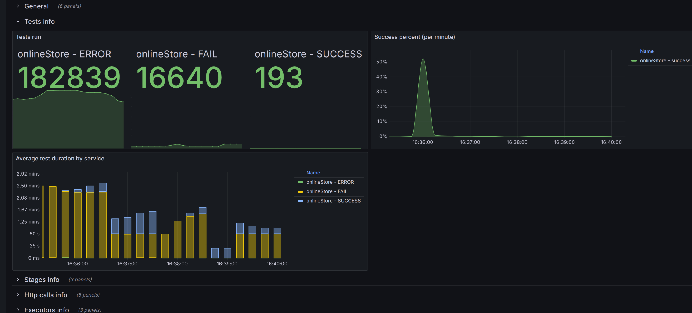
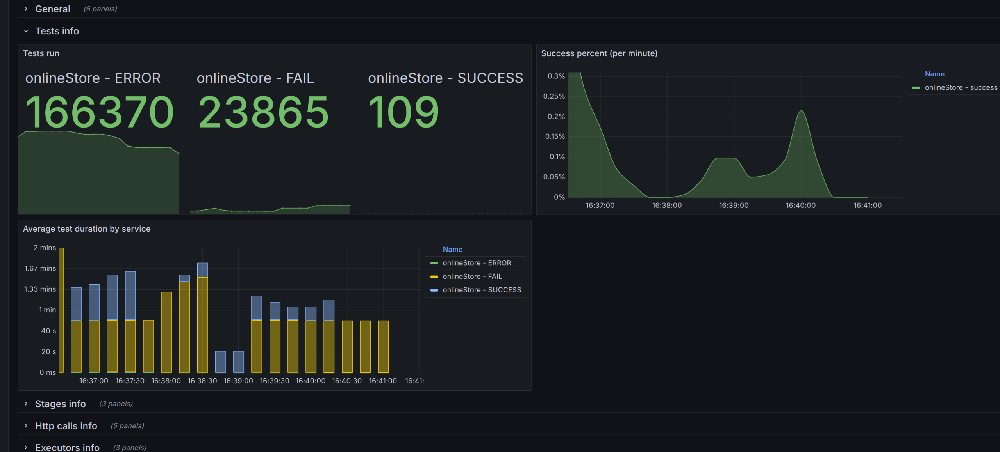

**Анализ изначальных условий:**

 { 
"ratePerSecond": 1000, 
"testCount": 200000, 
"processingTimeMillis": 50000 
}

{width="6.6930555555555555in" height="3.14375in"}
.
Задача определенно не самая простая, видно, что пиковая нагрузка не дает шанса решению.

**Идеи:**
- Повозиться с параметрами
- Добавить новые реализации старого

**Реализация идей:**

- Повозиться с параметрами

Путем повышения многих начальных параметров, получилось добиться небольшого улучшения, но все равно далеко до идеала. Система нестабильна.

{width="6.6930555555555555in" height="3.14375in"}

- Добавить новые реализации старого

В процессе.
